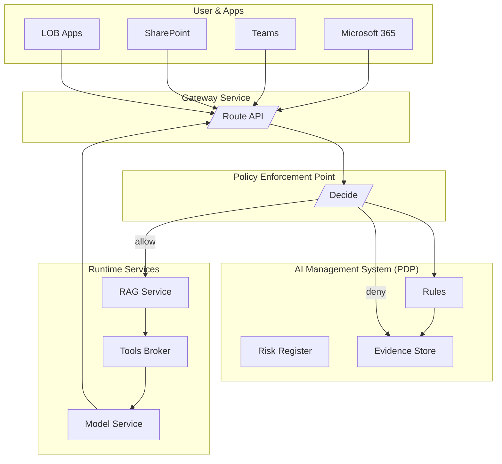

# SentinelFlow

**SentinelFlow** is a microservices-based platform for **policy-aware AI orchestration**.  
It demonstrates how **governance, risk, and compliance (GRC)** controls can be **natively integrated** into AI workflows, ensuring that every model call is auditable, policy-driven, and aligned with enterprise requirements.

Traditional AI pipelines focus on speed and accuracy but often lack **policy enforcement, risk awareness, and evidence logging**. SentinelFlow fills this gap by embedding **Microsoft Purview–style governance** and **AI Management System (AIMS)** controls directly into the runtime path.  

By doing so, SentinelFlow provides:
- 🔒 **Security and Governance** → All requests evaluated by a Policy Enforcement Point (PEP) against organizational policies before execution.  
- 📊 **Observability and Auditability** → Every decision and model interaction is logged into an Evidence Store for compliance reporting.  
- ⚖️ **Risk and Impact Awareness** → Dynamic checks against risk registers and Data Protection Impact Assessments (DPIAs).  
- ⚙️ **Pluggable AI Runtime** → Works with Retrieval-Augmented Generation (RAG), tool brokers, and hosted models in a microservices design.  
- ☁️ **Cloud-Native Design** → Deployable on any Kubernetes distribution (EKS, GKE, AKS, or on-prem), with CI/CD pipelines via GitHub Actions and GHCR container registry support.  

In short, SentinelFlow is not just an AI service layer—it is a **trust fabric** that ensures every AI decision is **explainable, compliant, and enterprise-ready**.

---

## ✨ Features
- **Gateway** → Entry point, routes requests and enforces decisions  
- **PEP** → Policy Enforcement Point, delegates to PDP  
- **AIMS (PDP)** → Policy Decision Point, evaluates rules & logs evidence  
- **RAG Service** → Adds retrieval-augmented context before inference  
- **Tools Service** → Stub for external APIs/tools  
- **Models Service** → Simple hosted model stub (echo + context)  
- **Audit/Evidence** → Evidence store via AIMS (`/v1/evidence`)

---

## 📚 References  

- Burns, B., Grant, B., Oppenheimer, D., Brewer, E., & Wilkes, J. (2016). *Borg, Omega, and Kubernetes*. Communications of the ACM, 59(5), 50–57. https://doi.org/10.1145/2890784  
- European Commission. (2021). *Proposal for a Regulation laying down harmonised rules on artificial intelligence (Artificial Intelligence Act)*. https://eur-lex.europa.eu/legal-content/EN/TXT/HTML/?uri=CELEX:52021PC0206
- Floridi, L., & Cowls, J. (2022). *A unified framework of five principles for AI in society*. Harvard Data Science Review, 4(1). https://papers.ssrn.com/sol3/papers.cfm?abstract_id=383132   
- ISO. (2023). *ISO/IEC 42001: Artificial Intelligence Management System (AIMS)*. International Organization for Standardization. https://www.iso.org/standard/81230.html  
- Lewis, P., Perez, E., Piktus, A., Petroni, F., Karpukhin, V., Goyal, N., ... & Riedel, S. (2020). *Retrieval-augmented generation for knowledge-intensive NLP tasks*. Advances in Neural Information Processing Systems (NeurIPS). https://arxiv.org/abs/2005.11401  
- Microsoft. (2023). *Microsoft Purview: Unified data governance*. Microsoft Docs. https://learn.microsoft.com/purview  
- NIST. (2023). *Artificial Intelligence Risk Management Framework (AI RMF 1.0)*. National Institute of Standards and Technology. https://doi.org/10.6028/NIST.AI.100-1  
- OECD. (2023). *OECD Framework for the Classification of AI Systems*. Organisation for Economic Co-operation and Development. https://oecd.ai  


---

## 🗂️ Architecture


---

# SentinelFlow — Quick Ops Cheat Sheet

## 📦 Local Development (Docker Desktop)

```
# from repo root
docker compose up --build -d

# health checks
curl.exe http://localhost:8080/healthz   # gateway
curl.exe http://localhost:8084/healthz   # pep
curl.exe http://localhost:8090/healthz   # aims
curl.exe http://localhost:8081/healthz   # rag
curl.exe http://localhost:8082/healthz   # tools
curl.exe http://localhost:8083/healthz   # models

```
## ✅ Test requests (via Gateway)
```
# Allowed path
curl.exe -X POST http://localhost:8080/v1/route `
  -H "Content-Type: application/json" `
  -d "{\"user_id\":\"u1\",\"prompt\":\"Draft a friendly email (no secrets).\",\"sensitivity\":\"Public\",\"labels\":[\"Public\"]}"

# Denied path (policy hit)
curl.exe -X POST http://localhost:8080/v1/route `
  -H "Content-Type: application/json" `
  -d "{\"user_id\":\"u1\",\"prompt\":\"my password is 123\",\"sensitivity\":\"Confidential\",\"labels\":[\"Confidential\"]}"

# Evidence log (AIMS)
curl.exe http://localhost:8090/v1/evidence
```
## ☸️ Kubernetes Deployment (images in GHCR)
```
# login to GHCR
docker login ghcr.io -u <USERNAME> -p <TOKEN>

# build & push all services (example loop)
$services = @("gateway","pep","aims","rag","tools","models")
foreach ($s in $services) {
  docker build -t ghcr.io/<org>/<repo>/$s:dev ".\services\$s"
  docker push ghcr.io/<org>/<repo>/$s:dev
}

```
## 🧭 Helm deploy (any K8s cluster/context)
```
# namespace + chart install/upgrade
helm upgrade --install platform .\charts\platform `
  -n prod --create-namespace `
  --set global.registry=ghcr.io `
  --set global.owner=<org>/<repo> `
  --set global.tag=dev

# verify rollout and service endpoint
kubectl -n prod rollout status deploy/sentinelflow-gateway
kubectl -n prod get svc sentinelflow-gateway

# (optional) quick access via port-forward
kubectl -n prod port-forward svc/sentinelflow-gateway 8080:80
curl.exe http://localhost:8080/healthz 
