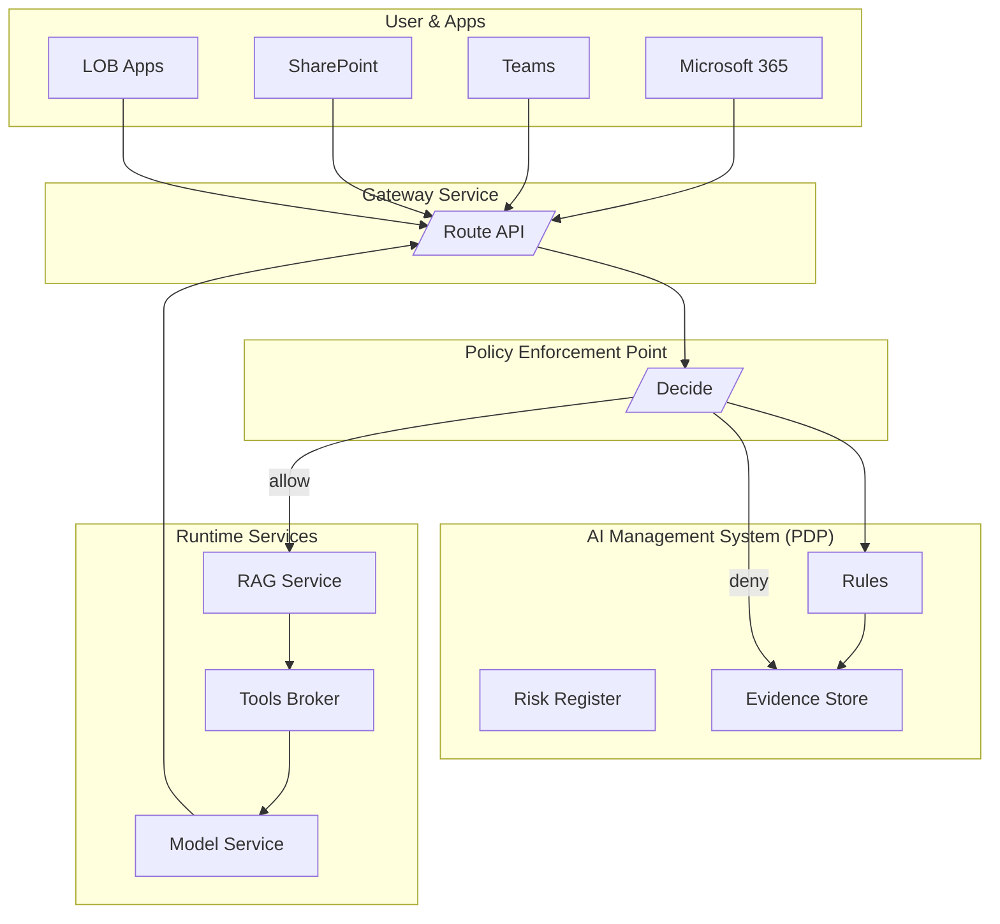

# SentinelFlow

**SentinelFlow** is a microservices-based platform for **policy-aware AI orchestration**.  
It demonstrates how governance, risk, and compliance (GRC) controls (e.g., Purview-style policies, AIMS enforcement) can be integrated directly into AI service pipelines, with full observability and evidence tracking.

---

## ✨ Features
- **Gateway** → Entry point, routes requests and enforces decisions  
- **PEP** → Policy Enforcement Point, delegates to PDP  
- **AIMS (PDP)** → Policy Decision Point, evaluates rules & logs evidence  
- **RAG Service** → Adds retrieval-augmented context before inference  
- **Tools Service** → Stub for external APIs/tools  
- **Models Service** → Simple hosted model stub (echo + context)  
- **Audit/Evidence** → Evidence store via AIMS (`/v1/evidence`)

---

## 🗂️ Architecture


# SentinelFlow — Quick Ops Cheat Sheet

## 📦 Local Development (Docker Desktop)

```
# from repo root
docker compose up --build -d

# health checks
curl.exe http://localhost:8080/healthz   # gateway
curl.exe http://localhost:8084/healthz   # pep
curl.exe http://localhost:8090/healthz   # aims
curl.exe http://localhost:8081/healthz   # rag
curl.exe http://localhost:8082/healthz   # tools
curl.exe http://localhost:8083/healthz   # models

```
## ✅ Test requests (via Gateway)
```
# Allowed path
curl.exe -X POST http://localhost:8080/v1/route `
  -H "Content-Type: application/json" `
  -d "{\"user_id\":\"u1\",\"prompt\":\"Draft a friendly email (no secrets).\",\"sensitivity\":\"Public\",\"labels\":[\"Public\"]}"

# Denied path (policy hit)
curl.exe -X POST http://localhost:8080/v1/route `
  -H "Content-Type: application/json" `
  -d "{\"user_id\":\"u1\",\"prompt\":\"my password is 123\",\"sensitivity\":\"Confidential\",\"labels\":[\"Confidential\"]}"

# Evidence log (AIMS)
curl.exe http://localhost:8090/v1/evidence
```
## ☸️ Kubernetes Deployment (images in GHCR)
```
# login to GHCR
docker login ghcr.io -u <USERNAME> -p <TOKEN>

# build & push all services (example loop)
$services = @("gateway","pep","aims","rag","tools","models")
foreach ($s in $services) {
  docker build -t ghcr.io/<org>/<repo>/$s:dev ".\services\$s"
  docker push ghcr.io/<org>/<repo>/$s:dev
}

```
##🧭 Helm deploy (any K8s cluster/context)
```
# namespace + chart install/upgrade
helm upgrade --install platform .\charts\platform `
  -n prod --create-namespace `
  --set global.registry=ghcr.io `
  --set global.owner=<org>/<repo> `
  --set global.tag=dev

# verify rollout and service endpoint
kubectl -n prod rollout status deploy/sentinelflow-gateway
kubectl -n prod get svc sentinelflow-gateway

# (optional) quick access via port-forward
kubectl -n prod port-forward svc/sentinelflow-gateway 8080:80
curl.exe http://localhost:8080/healthz 
